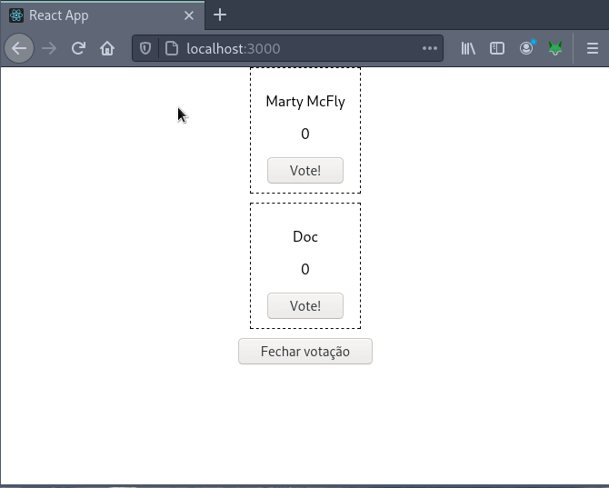

# Atividade React 

Você foi contratado pelo governo de um país norte americano para modernizar
o processo de contagem dos votos das eleições dessa nação.

Para isso, você deve utilizar `React.js` e `create-react-app`. É uma exigência do departamento de inteligência
do governo. *We can neither confirm nor deny this information*.

O sistema de votação deve ser simples. De forma geral, um objeto chamado `candidates`, que contém o nome dos candidatos, deve ser lido (pode estar *hardcoded* no `App.js`). A partir desse objeto, cada candidato será exibido na tela com uma quantidade de votos (zero a princípio) e um botão votar. Ao clicar no botão votar de um determinado candidato, seu contador de votos deve ser incrementado em uma unidade. Apenas uma. Não queremos denúncias de fraude.

Ao final da contagem, um botão "Finalizar contagem" será pressionado. O conteúdo da tela será, então, substituído pela relação de candidatos e a quantidade de seus votos e uma mensagem informando o vencedor deverá ser apresentada.

Exemplo de funcionamento:

"Pontos extras para um layout maneiro" =>  *We can neither confirm nor deny this information*.

